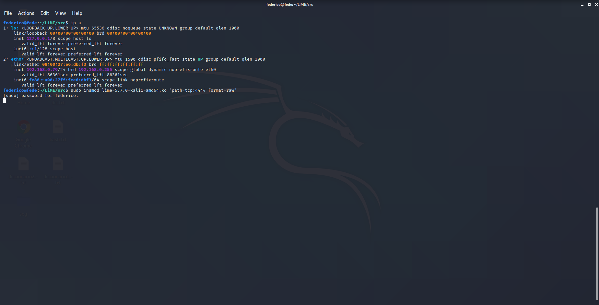
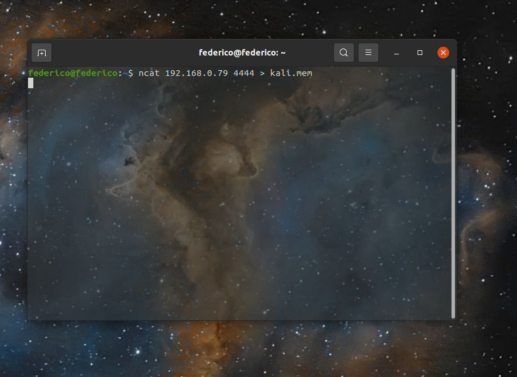
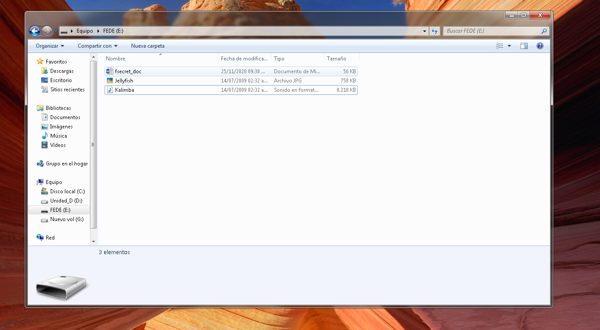
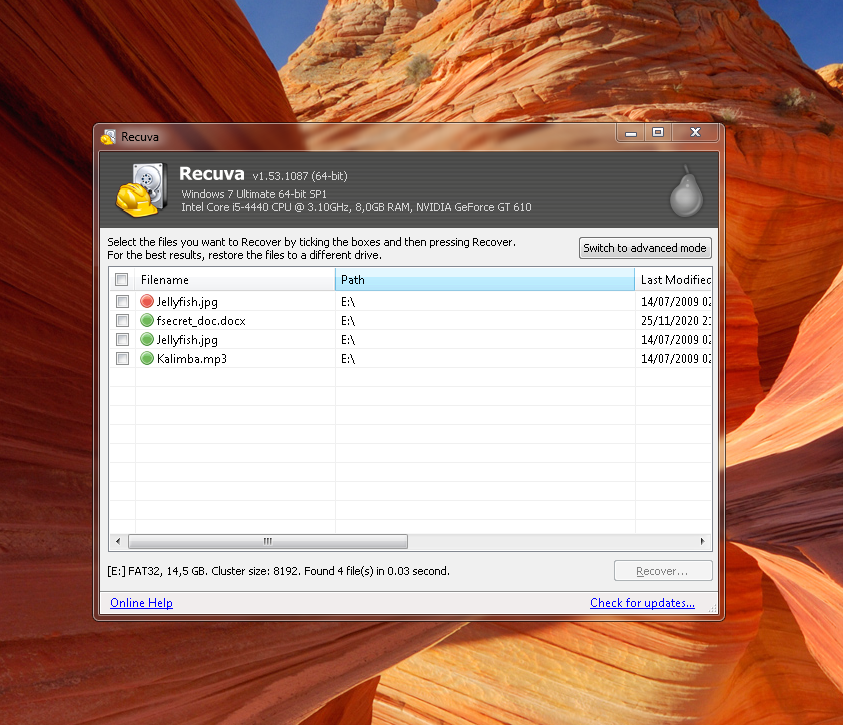

# Escalera Pedro, Iman Federico

### Ej 1

  

Para comenzar el ejercicio 1 lo primero que hicimos fue descargar zzuf y el parser de bmp. Luego lo que hicimos fue correr el parser de bmps con el archivo mono.bmp para ver como se veia una ejecución exitosa. Después fuzzeamos el archivo mono.bmp con zzuf y lo pusimos a correr con las seed entre 0 y 100 para comenzar. El comando que usamos fue `zzuf -c -s 0:100 ./parse mono.bmp`. Así obtuvimos que con la seed= 7 y el ratio de fuzzeo por defecto (0.04) el programa crasheaba con un segmentation fault. Analizando con gdb vimos que este se daba al intentar hacer un memcpy. Para obtener mas datos usamos PwnGdb que nos dejaba ver claramente si el EIP se había modificado con el fuzzeo. Después armamos un script en python que iba pasando seed randoms a zzuf y se fijaba con gdb si había cambiado el EIP. Lo dejamos andando toda la noche y no dio resultado. Por esto decidimos cambiar a AFL que nos pareció una herramienta mucho mas simple de usar (ya que no tuvimos que armar ningún exploit manual nuestro) y encontró un crash que modificaba el EIP relativamente rápido, lo dejamos dos horas andando en dos threads y uno de los crashes modificaba el EIP. Para usar AFL lo único que hicimos fue modificar el makefile para que compile con el gcc de afl (algo que es recomendado en el [github](https://github.com/google/AFL) para aumentar la performance y luego simplemente lanzamos el fuzzer con `./AFL/afl-fuzz -t 100 -i ./testcase -o ./AFL_OUTPUT ./parse @@` . Luego de correrlo comprobamos cada uno de los crashes que se habían generado con GDB hasta que encontramos uno que había tenido un segmentation fault debido a un "Invalid $PC address: 0x4040404" Esto claramente indicaba que el EIP estaba apuntando a una dirección no valida. A partir de ahí fue cuestión de buscar en que parte del archivo se encontraba esa dirección en particular. Haciendo un hexdum del archivo con hd vimos que había varias partes donde se encontraba ese numero así que lo primero que intentamos fue remplazar todas las apariciones por un numero que nosotros quisiéramos y ver si seguía crasheando. Vimos que si lo hacia y analizamos como afectaba el replace a la dirección del EIP. Después de refinar bien como hacer para que quedara la dirección que queríamos en el EIP (haciendo lo que llamamos la transformación mágica en el código porque no analizamos mucho porque hacia falta, solo fuimos tocando hasta que quedo como queríamos) terminamos el script crash_modifier que toma una address de argumento y genera un nuevo archivo new_crash que deja el EIP en la dirección que le pasamos como argumento. (Uso: "crash_modifier.py 48151623" donde 48151623 seria a donde queremos que apunte el EIP)

  
  

### Ej 2

##### Manticore

  

##### Angr

Con la tool angr pudimos resolver el binario r1 leyendo la documentación de angr y con ayuda de los muchos ejemplos de problemas resueltos usando esta herramienta.

Para esto escribimos el código solangr.py

  
  

    #python 3

    

    import angr

    

    p=angr.Project('./r1',auto_load_libs=False)

    

    state=p.factory.entry_state()

    

    simgr=p.factory.simgr(state)

    #Direccion del Puts(puts("\nSuccess!! Too easy.");) que queremos ejecutar(en find)

    #Direccion del Puts que no queremos ejecutar(en avoid)

    res=simgr.explore(find=0x08048570,avoid=0x0804852d)

    

    print (res.found[0].posix.dumps(0))

  

El cual nos da como salida

  

    b'5up3r_DuP3r_u_#_1\xd9\xd9\xd9\xd9\xd9\xdb\xd9\xd9\xd9\xd9\xd9\xd9\xd9\xd9\xd9\xd9\xd9\xd9\xd9\xd9\xd9\xd9\xd9\xd9\xd9\xd9\xd9\xd9\xd9\xd9\xd9\xd9\xd9\xd9\xd9\xd9\xd9\xd9\xd9\xd9\xd9\xd9\xd9'

  

Y la respuesta al problema es justamente

    5up3r_DuP3r_u_#_1

  

#### Ej 3

Un análisis forense es tremendamente útil la obtención del volcado de memoria volátil y su posterior análisis, sobretodo porque muchos artefactos de malware usan funciones que no dejan datos en disco.

  

Las herramientas mas comunes y conocidas para la extracción y análisis de memoria en linux son:

  

1. Volatility Framework: quizás una de las más famosas colecciones de herramientas para la extracción y el análisis de la memoria volátil (RAM). Sin embargo el soporte para Linux es todavía experimental: ver la página LinuxMemoryForensics en el Volatility wiki. (Licencia GNU GPL)

  

2. LiME (Linux Memory Extractor): presentado en la ShmooCon 2012, es un módulo cargable para el kernel (LKM) y permite la adquisición de memoria incluso en Android.

  

3. Draugr: interesante herramienta que puede buscar símbolos del kernel (patrones en un fichero XML o con EXPORT_SYMBOL), procesos (información y secciones) (por la lista de enlaces del kernel o por fuerza bruta) y desensamblar/volcar la memoria.

  

4. Volatilitux: framework en Python equivalente a Volatility en Linux. Soporta arquitecturas ARM, x86 y x86 con PAE activado.

  

5. Memfetch: sencilla utilidad para volcar la memoria de procesos en ejecución o cuando se descubre una condición de fallo (SIGSEGV).

  

6. Crash utility from Red Hat, Inc: es una herramienta independiente para investigar tanto los sistemas en funcionamiento como los volcados de memoria del kernel hechos con lo paquetes de Red Hat netdump, diskdump o kdump. También se puede utilizar para el análisis forense de memoria.

  

7. Memgrep: sencilla utilidad para buscar/reemplazar/volcar memoria de procesos en ejecución y ficheros core.

  

8. Memdump: se puede utilizar para volcar la memoria del sistema al stream de salida, saltando los huecos de los mapas de la memoria. Por defecto vuelca el contenido de la memoria física (/dev/mem). Se distribuye bajo la Licencia Pública de IBM.

  

9. Foriana: esta herramienta es útil para la extracción de información de procesos y listas de módulos desde una imagen de la RAM con la ayuda de las relaciones lógicas entre las estructuras del sistema operativo.

  

11. Forensic Analysis Toolkit (FATKit): un nuevo framework multiplataforma y modular diseñado para facilitar la extracción, análisis, agregación y visualización de datos forenses en varios niveles de abstracción y complejidad de datos.

  

12. The Linux Memory Forensic Acquisition (Second Look): esta herramienta es una solución comercial con un driver de crashing modificado y scripts para volcado.

  

[Fuente](https://www.cyberciti.biz/programming/linux-memory-forensics-analysis-tools/)

  

Luego para realizar el dumpeo de memoria, decidimos usar la maquina virtual de kali linux instalada en el practico 1.

Utilizamos la herramienta Lime

Lo primero que hicimos fue instalar lime en kali, y averiguar la dirección ip de la maquine virtual, ya que enviaremos por tcp el dump de la memoria.

  

  

una vez hecho esto, nos pusimos en nuestra maquina local, a escuchar con netcat

  

  

Una vez hecho esto, conseguimos el archivo kali.mem con el dump de memoria, el cual se encuentra disponible para descargar en este [link](https://drive.google.com/file/d/1Q-d86X4v9o_zB_7bYYy9JPzQ5j-qZS2R/view?usp=sharing).

  

#### Ej 4

  
  

Ahora, para realizar un dumpeo de memoria

  

Utilizamos la herramienta Recuva de windows para recuperar los archivos, es una herramienta muy simple de usar en que para nuestro caso funciono perfecto con los 3 archivos que intentamos recuperar.

  

  

Una vez recuperados los archivos pasamos a intentar crackear las password de fsecret_doc.docx

  

Para esto investigamos un poco en internet las herramientas nombradas en el ejercicio y encontramos el siguiente [link](https://byte-mind.net/crackear-documentos-office-protegidos-con-contrasena/)

El cual nos muestra una herramienta para obtener el hash llamada Office2John y corriendo el comando:

  

    python office2john.py fsecret_doc.docx > hash.txt

  

obtenemos el siguiente hash:

  

    fsecret_doc.docx:$office$*2007*20*128*16*ba1ae53b4d016fc3a15124b2a3034779*49a69de2853eac6c62cceeeb549aac18*57e5fd8bfd182b4c70071a3052b91194e048055c

  
  

una vez obtenido el hash, usamos la herramienta hashcat que ya bien conocemos. Primero realizando ataques con el diccionario 1 sin resultados, luego con el 2, nuevamente sin resultados, y finalmente con una combinación de ambos usando el siguiente comando:

  

    hashcat -a 1 -m 9400 --username hash.txt diccionario1.txt diccionario2.txt

  

y obteniendo como resultado la clave:

  

    jimmyisno.1saop91

  

Aclaración: el Link antes citado dice que a el hash obtenido debemos borrarle el inicio (nombre del archivo y los :) Pero esto no es verdad, ya que eliminando esto hashcat no reconoce el hash por lo que no hay que editar el hash obtenido con office2john.py

  

### Ej 5

  

Para este ejercicio lo primero que tuvimos que hacer fue buscar el profile de volatility que funcionara con el sistema operativo de donde se saco la imagen. Esta la conseguimos de el [github de volatilty foundation ](https://github.com/volatilityfoundation/profiles/tree/master/Linux). Luego empezamos a ver que opciones podíamos usar para buscar el rootkit kbeast. El primero que probamos fue `linux_check_fop` cuya descripción indica que es para detectar rootkits en linux analizando operaciones sobre archivos, lamentablemente no nos dio resultado así que buscamos otras opciones. El primer resultado lo obtuvimos corriendo `linux_check_modules` que analiza si hay módulos de kernel que están en memoria pero que no se encuentran en la lista de módulos cargados (porque se quitaron a ellos mismos de la lista). Muchos rootkits utilizan este método ya que si uno analiza la lista de módulos de kernel no parece haber nada extraño. Este comando ya nos dio la primera señal de que kbeast se encuentra en el sistema ya que nos devolvió un modulo que esta cargado pero no se encuentra en la lista: "ipsecs_kbeast_v1". Esto ya parece ser una señal bastante clara pero veamos un poco mas si encontramos conexiones extrañas o syscalls manipuladas. Para controlar las syscalls podemos utilizar el comando `linux_check_syscall`. Corriendo este comando ya podemos ver que Kbeast ya tiene efectivamente muchisimo control sobre el sistema. Muchas de las syscalls mas utilizadas como write, kill, open, etc aparecen como "HOOKED", Esto quiere decir que kbeast esta interviniendo todas las llamadas que se hacen a esas funciones y puede estarlas logueando, modificando o haciendo mil cosas mas con cada una de ellas.

Los comandos que probamos anteriormente fueron particularmente los que dieron resultado, a la hora de buscar rootkits muchos mas se pueden utilizar. Como primera aproximación al problema siempre es una buena idea analizar los proces corriendo con `linux_pslist` (cuando nosotros lo corrimos no vimos nada extraño) y buscar entre los procesos que estaban corriendo a la hora de capturar la imagen si hay alguno que no sea fácilmente reconocible (y googlearlo) o si hay algunos con letras y símbolos extraños. También puede ser una buena opción analizar que conexiones estan hechas con `linux_netstat` para ver que no haya nada sospechoso. Finalmente si lo anterior no dio resultado lo mas probable es que si hay algún malware sea un rootkit que se esta alojando en el espacio de kernel. Para este tipo de amenazas se pueden usar los comandos como `linux_check_fop`, `linux_check_modules`, `linux_check_syscall` para detectar alteraciones y modificaciones en los módulos de kernel y llamadas a syscalls. En el caso de linux_check_modules no deberían dar ningún resultado ya que ninguna aplicación con buenas intenciones debería estarse escondiendo de la lista de módulos de kernel cargados. Y en el caso de las syscalls todas debería estar apuntando a las direcciones correctas y no estar "Hookeadas". Una pagina que nos sirvió muchísimo para entender como actúan los malwares y rootkits y como hace volatility para detectar casos extraños fue [VolatilityLabs](https://volatility-labs.blogspot.com/) que contiene muchos análisis de malware con volatility.
